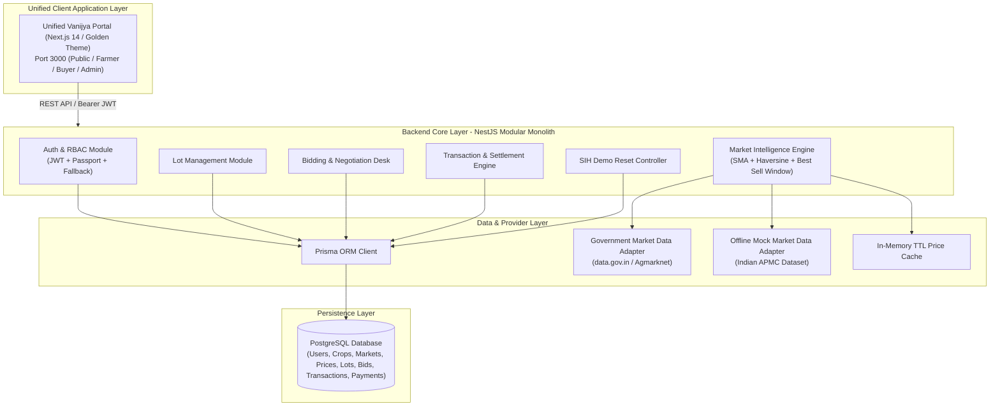

# Vanijya (वाणिज्य) — System Architecture & Technical Specification
**Smart India Hackathon 2026 | Problem Statement 26132**

---

## 1. High-Level Architecture Diagram

---

## 2. Technical Stack

| Layer | Technology | Rationale |
| :--- | :--- | :--- |
| **Monorepo Architecture** | npm workspaces | Unified type safety across `@vanijya/shared-types`, `@vanijya/shared-utils`, backend, and web portal. |
| **Backend Core** | NestJS (TypeScript) | Enterprise-grade modular architecture with dependency injection, OpenAPI/Swagger docs, and built-in validation pipes. |
| **Database & ORM** | PostgreSQL + Prisma ORM | Relational integrity, ACID atomic transactions (`$transaction`), and type-safe schema queries. |
| **Unified Web Client** | Next.js 14 (App Router, Tailwind CSS) | Role-aware unified application supporting Public Price Discovery, Farmer Sell Hub, Buyer B2B Marketplace, and Admin Analytics. |
| **Price Analytics** | Custom In-Memory Analytics Service | 7-day Simple Moving Average (SMA), momentum detection (`BULLISH`/`BEARISH`/`STABLE`), spatial Haversine distance arbitrage. |
| **Design System** | Golden Yellow Agricultural Palette | High-contrast gold & slate theme with micro-interactions, shimmer loading, and full trilingual localization. |
