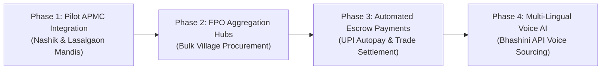

# Vanijya (वाणिज्य) — Future Roadmap & Scale Plan
**Smart India Hackathon 2024 — Problem Statement 26132**

---

## 1. Post-Hackathon Vision (6–12 Month Horizon)

1. **Regional Language Voice AI (Bhashini API Integration):**
   - Enable voice-based price queries and crop lot publishing in Hindi, Marathi, Punjabi, Telugu, and Kannada for smallholder farmers.
2. **e-NAM & State APMC Direct Sync:**
   - Formal gateway integration with national e-NAM corridors and state electronic trading portals.
3. **Smart Contract Escrow Payments:**
   - Escrow lock of buyer funds upon bid acceptance, releasing funds automatically upon digital QR confirmation at weighbridge loading.
4. **Logistics & Aggregator Linkage:**
   - Integrated fleet matching with rural transport aggregators to share freight costs among neighboring smallholders.
