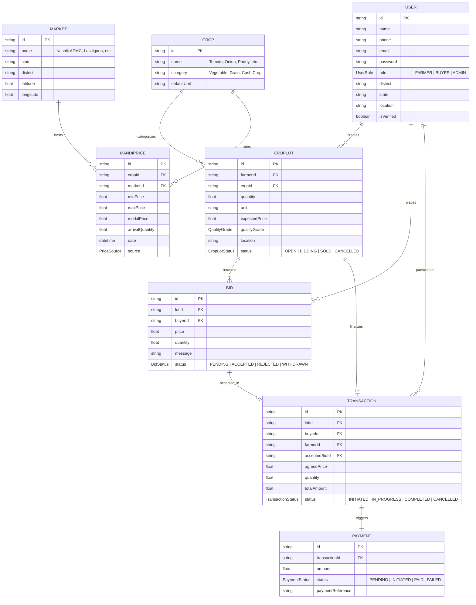

# Vanijya (वाणिज्य) — Technical Architecture
**Smart India Hackathon 2024 — Problem Statement 26132**

---

## 1. Architectural Blueprint

```mermaid
graph TB
    subgraph Client_Applications [Client Applications Layer]
        FW["Farmer Web Portal (:3001)<br/>Next.js 14 • Mobile-First • SVG Analytics"]
        BW["Buyer Procurement Portal (:3002)<br/>Next.js 14 • B2B Marketplace • Live Bidding"]
    end

    subgraph Core_Backend [NestJS Modular Monolith Layer (:4000)]
        AuthMod["Auth & RBAC (JWT + Bcrypt)"]
        PriceMod["Market Intelligence Engine"]
        LotsMod["Lot Management"]
        BidsMod["Bidding & Negotiation"]
        TxnMod["Transaction & Settlement"]
        DemoMod["Demo Reset Controller"]
        AnalyticsMod["Platform Analytics & Impact"]
    end

    subgraph Data_Intelligence [Data & Provider Layer]
        PrismaORM["Prisma ORM Client"]
        GovAdapter["Government Market Data Provider (data.gov.in)"]
        MockAdapter["Offline Mock APMC Provider"]
        PriceCache["In-Memory TTL Price Cache"]
    end

    subgraph Database [Persistence Layer]
        PostgreSQL[("PostgreSQL Database<br/>8 Relational Entities")]
    end

    FW -->|REST API + Bearer JWT| Core_Backend
    BW -->|REST API + Bearer JWT| Core_Backend
    Core_Backend --> PrismaORM
    PriceMod --> GovAdapter
    PriceMod --> MockAdapter
    PriceMod --> PriceCache
    PrismaORM --> PostgreSQL
```

---

## 2. Database Relational ER Diagram


