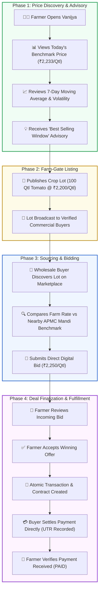

# Vanijya (वाणिज्य) — User Journey & Platform Infographic
**Smart India Hackathon 2024 — Problem Statement 26132**

---

## 1. End-to-End User Journey Map

---

## 2. Key Value Propositions for Indian Agriculture

| Dimension | Traditional Mandi Channel | Vanijya Digital Platform |
| :--- | :--- | :--- |
| **Price Discovery** | Asymmetric, controlled by local middlemen (*arhtiyas*) | Real-time Agmarknet benchmark data with 7-day Simple Moving Average |
| **Market Access** | Restricted to physical APMC yard within 10–20 km | Regional trade corridor discovery with automated spatial arbitrage calculation |
| **Commissions & Deductions** | 6% to 12% lost in unofficial commissions and weighing cuts | **0% Intermediary Commission** — 100% direct buyer-to-farmer settlement |
| **Payment Security** | Delayed credit payments, cash vulnerability | Transparent milestone tracking with recorded electronic bank transaction UTRs |
| **Selling Timing** | Distress distress selling upon harvest | **Rule-Based Best Selling Window** advisory based on price momentum and arrivals |
